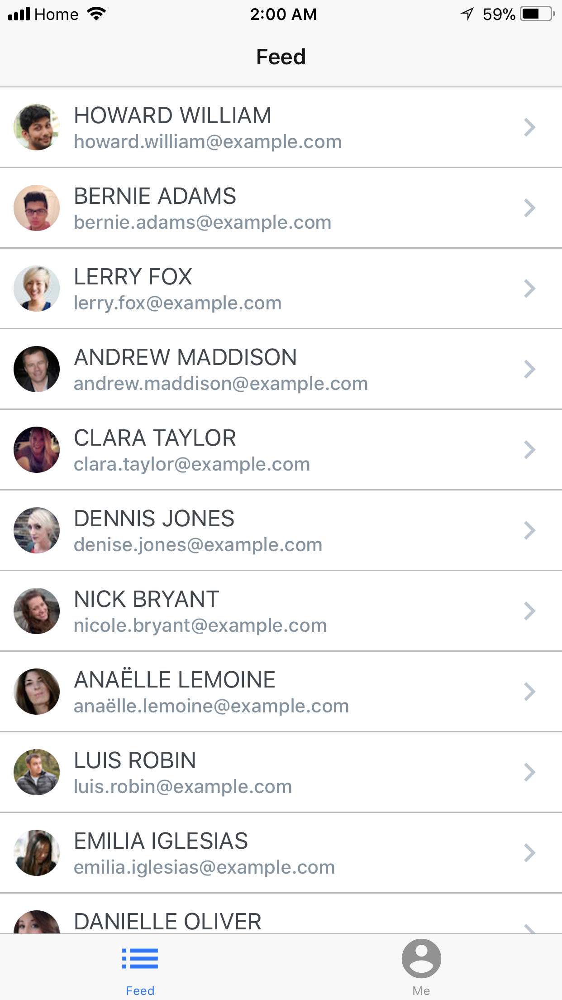
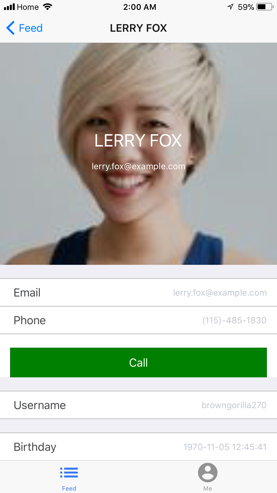
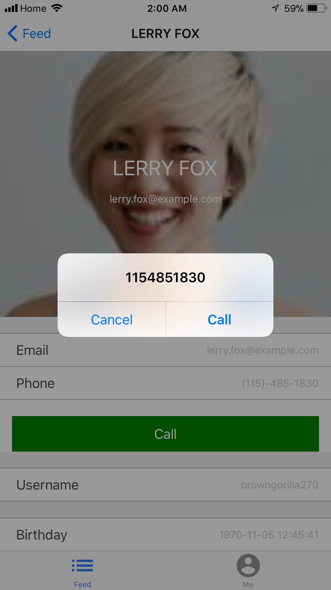
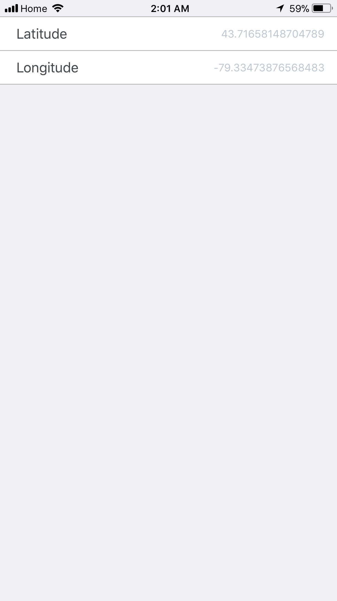

# CrossPlatform_React-Native_ContactsAppplication

Home screen : Shows the list of contacts which have been hardcoded in a file

Contact detail screen : Shows the details of the contact selected on previous screen

Call screen : Shows the feature of calling any contact in the list

Me Screen : Shows the details of the admin user

Geolocation Screen : Modal screen which shows the longitude and latitude of the admin user

